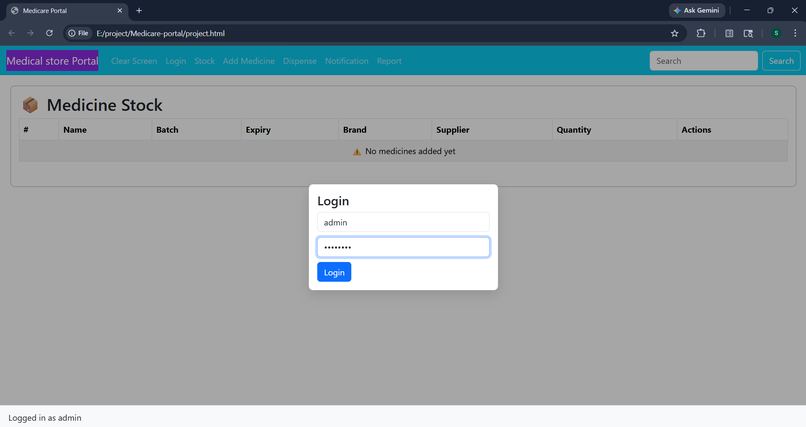
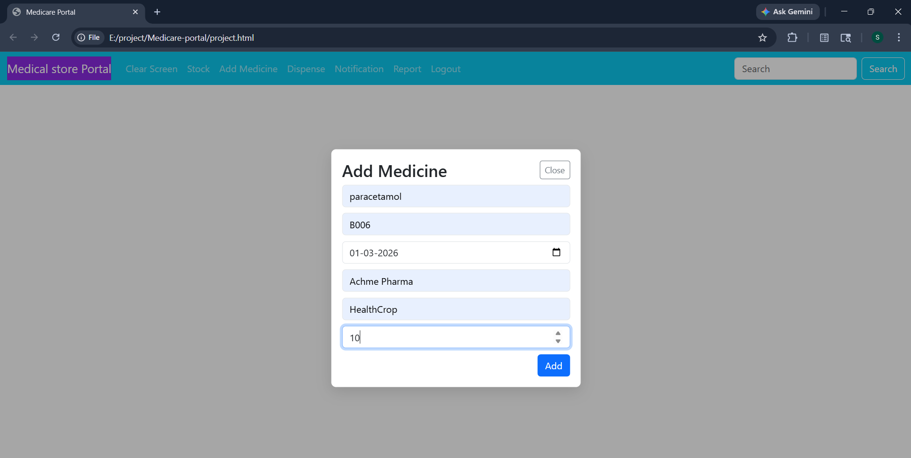
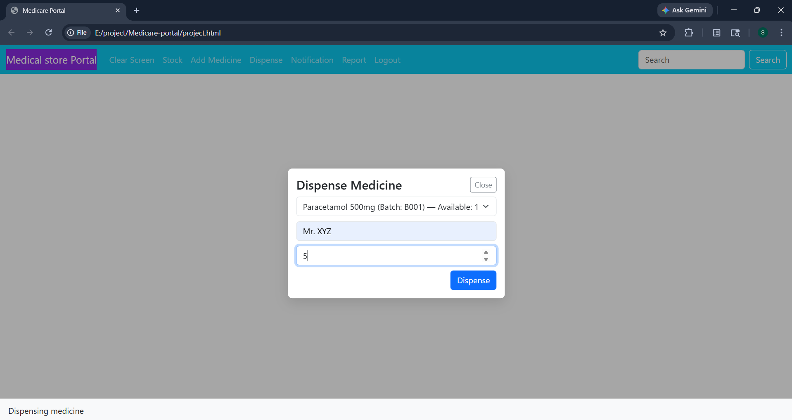
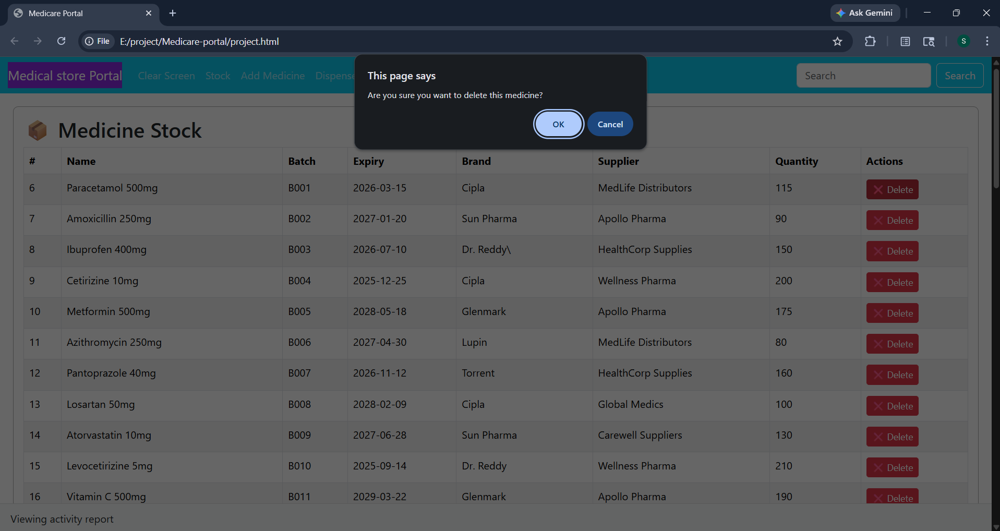
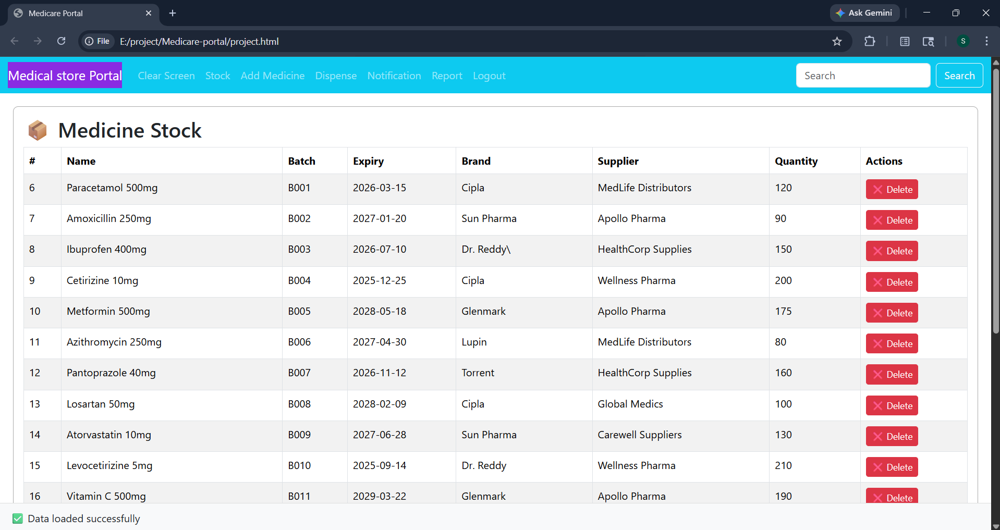
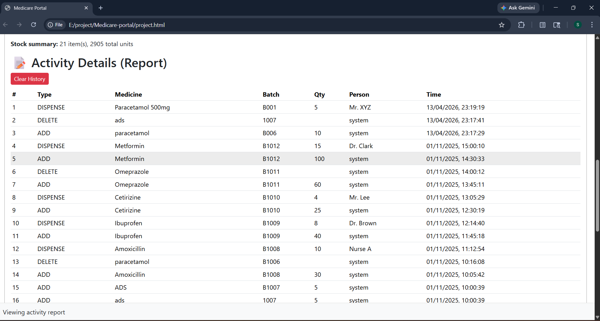
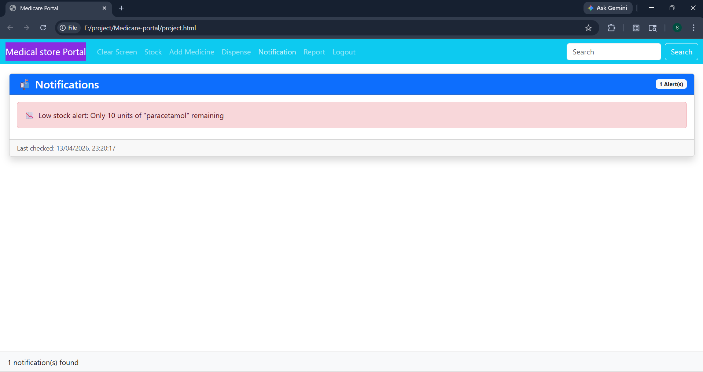

# Medicare-portal
> A lightweight pharmacy inventory and dispensing portal with an HTML/CSS/JS frontend and a **Node.js (Express)** backend API connected to **Microsoft SQL Server**.

---
 
## Tech Stack
 
| Layer    | Technology                              |
|----------|-----------------------------------------|
| Frontend | HTML, CSS, Bootstrap, vanilla JavaScript |
| Backend  | Node.js, Express, `mssql`               |
| Database | Microsoft SQL Server (via `mssql` package) |

---

## Features
 
1. **Add / Delete medicines** — add new stock or remove medicines; adding a duplicate batch + name combination merges the quantity instead of inserting a duplicate.
2. **Dispense medicines** — record dispensing events against a patient name; stock is reduced automatically, and the entry is deleted when quantity reaches zero.
3. **Notifications** — near-expiry and low-stock alerts surfaced from the database views.
4. **Activity history / report** — view the last 200 history entries (or a combined stock + 500-entry history report); clear history when needed.
5. **Duplicate-safe stock listing** — the API deduplicates results by ID before returning them.
6. **Stock-in report** — dedicated endpoint for `ADD`-type history entries only.
7. **Simple, responsive UI** — `project.html` + `style.css` + `script.js`.

---
 
## 🖼️ Screenshots









---

## Project Structure
 
```
Medicare-portal/
├── project.html          # Frontend — HTML + Bootstrap
├── script.js             # Frontend — JavaScript (fetch API calls)
├── style.css             # Frontend — Custom styles
├── server.js             # Backend — Node.js / Express REST API (port 5000)
├── create_database.sql   # SQL Server schema: tables, indexes, and views
├── package.json          # Node.js dependencies & scripts
├── package-lock.json
├── .env                  # Environment variables (not committed)
├── .gitignore
└── Screenshot/           # UI screenshots
```
---
 
## Prerequisites
 
- **Node.js** v16+ and npm
- **Microsoft SQL Server** (Express edition works), default instance `Shruti\SQLEXPRESS`
- A modern web browser (Chrome, Firefox, Edge)
---
 
## Installation & Setup
 
1. **Clone the repository**
   ```bash
   git clone https://github.com/potdarshruti/Medicare-portal.git
   cd Medicare-portal
   ```
 
2. **Create the database**
   Open SQL Server Management Studio (or `sqlcmd`) and run:
   ```bash
   sqlcmd -S localhost\SQLEXPRESS -i create_database.sql
   ```
 
   This creates the `Medicare_Portal` database with:
   - `medicines` table
   - `history` table
   - Performance indexes on both tables
   - `vw_expired_medicines` view (expiry < today)
   - `vw_low_stock_medicines` view (quantity < 10)
3. **Configure environment variables**
   Create a `.env` file in the project root (already listed in `.gitignore`):
   ```env
   SQL_SERVER=Shruti\SQLEXPRESS
   SQL_DATABASE=Medicare_Portal
   SQL_USER=sa
   SQL_PASSWORD=your_password
   PORT=5000
   ```
 
4. **Install Node.js dependencies**
   ```bash
   npm install
   ```
 
   Core dependencies: `express`, `cors`, `mssql`
5. **Start the backend**
   ```bash
   node server.js
   ```
 
   The API runs on `http://localhost:5000`. The database tables are created automatically on startup if they don't already exist.
6. **Open the frontend**
   Open `project.html` directly in your browser or serve it statically.
 
---
 
## Usage
 
1. Log in using the admin credentials configured in the UI (`admin` / `admin123` by default).
2. **Add Medicine** — fill in name, batch, expiry, brand, supplier, and quantity.
3. **Dispense** — select a medicine, enter quantity and patient name to record a dispensing event.
4. **Notifications** — view near-expiry and low-stock alerts.
5. **Report** — review full activity history and clear it when needed.
---

## Future Improvements
 
- [ ] Add user authentication with JWT
- [ ] Add role-based access (admin vs pharmacist)
- [ ] Deploy on cloud (Render / Railway)
- [ ] Add medicine search and filter
- [ ] Export reports as PDF

---
 
##  Author
 
**Shruti Potdar**  
B.Tech CSE | Sharad Institute of Technology, Kolhapur  
 
[](https://www.linkedin.com/in/potdarshruti)
[](https://github.com/potdarshruti)
 
---
 
*Built with ❤️ during 2nd year of B.Tech CSE*
